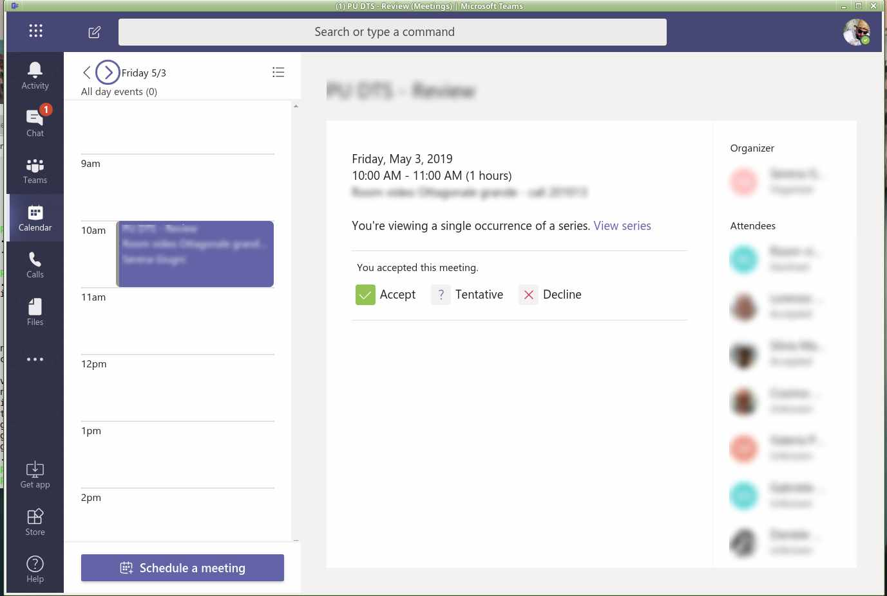
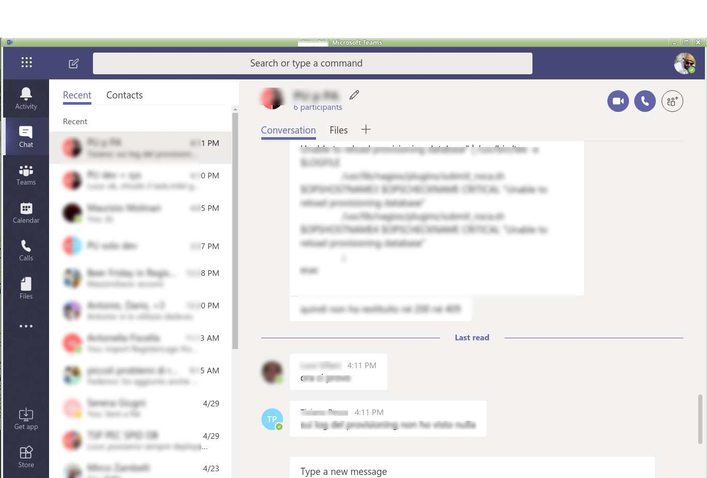
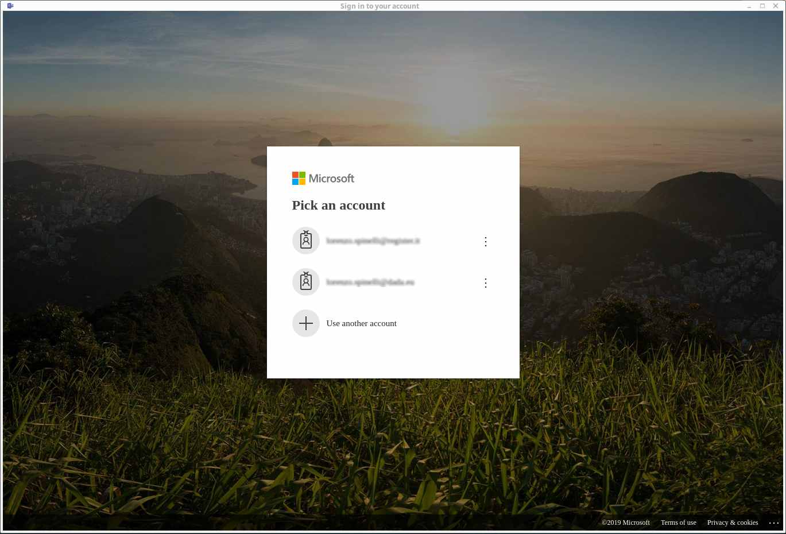

# Teams for linux

> Unofficial Microsoft Teams client for Linux


Unofficial Microsoft Outlook client for Linux using [Electron](https://electronjs.org/).
It uses the Web App and wrapps it as a standalone application using Electron.

## Install

You can download the tar.gz, deb or AppImage from the [releases page](https://github.com/Spyna/teams-for-linux/releases).


## Features: 

* Chat
* Call
* Desktop notification
* Minimize on close

## Screenshots










## Run from source

```bash
$ npm i
$ npm start
```


[](https://github.com/igrigorik/ga-beacon)
